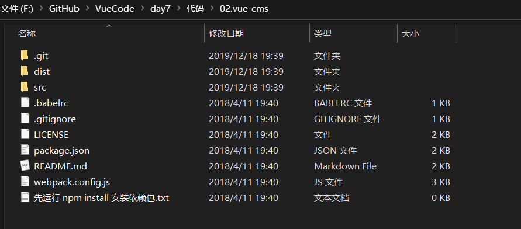
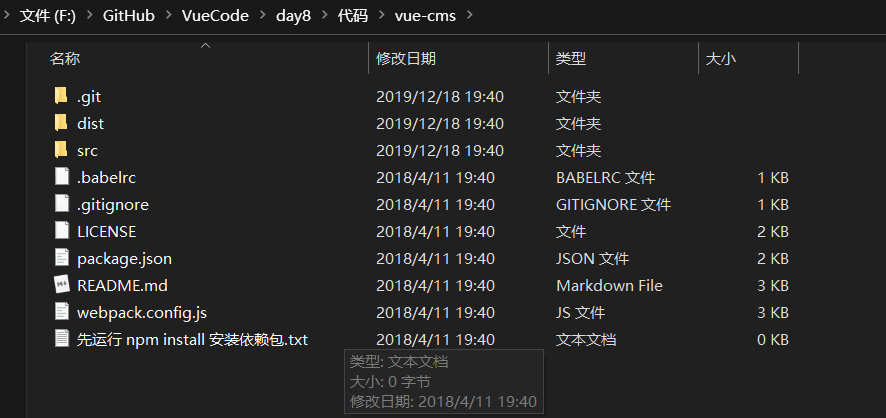
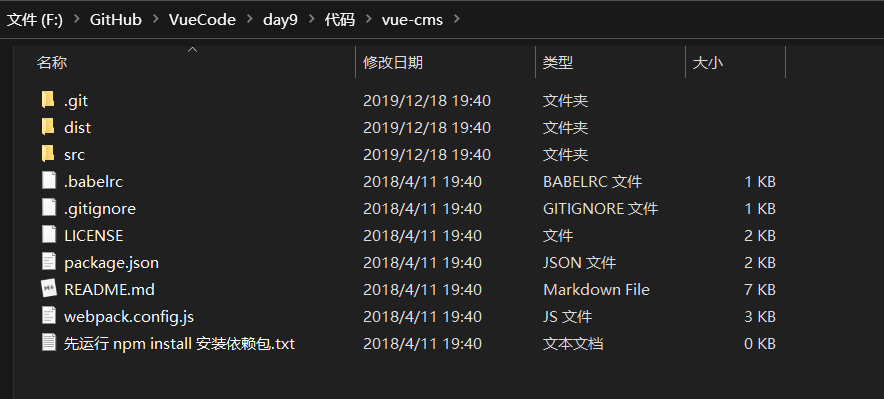
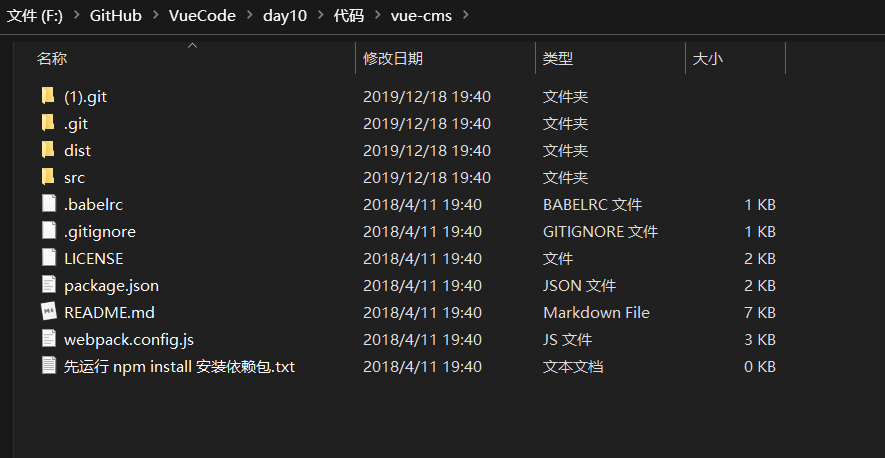
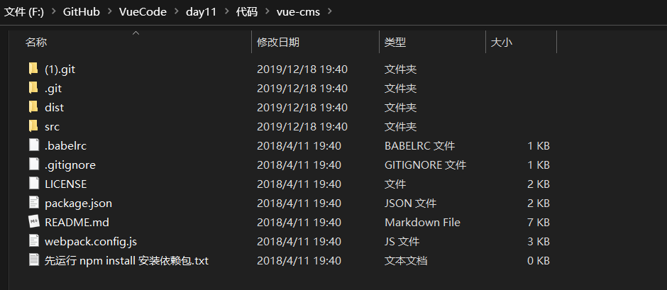

# VueCode
## vue11天学习的源代码、也是阿里云大学中的vue课程的源码

- 在day7、8、9、10、11中，上传的时候有.git文件不能直接上传，有一点丢失

  

### 19.12.20：

- **assets**文件夹是存放 **README.md** 文件中的**图片**的

- 已经将7、8、9、10、11的资料放进了压缩包里，方便需要的朋友

- day7 中无法上传的文件目录

  

- day8 中无法上传的文件目录

  

- day9 中无法上传的文件目录

  

- day10 中无法上传的文件目录

  

- day11 中无法上传的文件目录

  